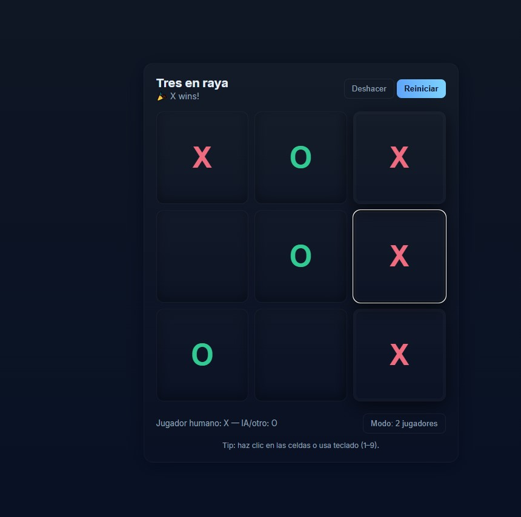

# 🎮 Tres en Raya (Tic-Tac-Toe)

Este es un proyecto simple del clásico juego **Tres en Raya (Tic-Tac-Toe)** implementado con **HTML**, **CSS** y **JavaScript**.  
El objetivo es practicar lógica de programación, manejo del DOM y separación de archivos en un proyecto web.

---

## 📂 Estructura de carpetas

└── src/
├── Index/
│ └── index.html # Estructura del juego
├── Styles/
│ └── style.css # Estilos y diseño del juego
└── Scripts/
└── script.js # Lógica del juego

---

## 🚀 Cómo ejecutar el proyecto

1. Clona este repositorio o descarga los archivos.
2. Abre el archivo **`index.html`** ubicado en `src/Index/` con tu navegador.
3. ¡Listo! Ya puedes jugar al Tres en Raya.

---

## 🎲 Funcionamiento del juego

- El tablero es de **3x3** celdas.
- El jugador **X** siempre empieza.
- El turno se alterna automáticamente entre **X** y **O**.
- El juego detecta:
  - ✅ Si un jugador gana (3 en línea).
  - 🤝 Si hay empate (todas las celdas llenas sin ganador).
- Se puede **reiniciar** la partida en cualquier momento con el botón **Reiniciar**.
- Hay dos modos de juego:
  - **2 Jugadores** → Dos personas en el mismo dispositivo.
  - **Jugador vs IA** → El jugador X contra una **IA básica** (la IA elige jugadas simples como centro, esquinas o bloqueo).

---

## ⌨️ Atajos de teclado

- Teclas **1–9** → Para marcar las celdas (arriba izquierda hasta abajo derecha).
- Tecla **0** → Reinicia la partida.

---

## 🛠️ Tecnologías utilizadas

- **HTML5** → Estructura del juego.
- **CSS3** → Estilos modernos y responsivos.
- **JavaScript (ES6+)** → Lógica del juego, turnos, detección de ganador y modo IA.

---

## ✨ Vista previa

  

---

## 📜 Licencia

Este proyecto es de uso libre con fines educativos.  
Puedes modificarlo, mejorarlo y compartirlo como quieras. 🎉
